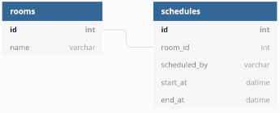

# Solution
1. The first point for solving this challenge was data modeling:

      

2. For next, the project was generated and configured to run with Docker, including the use of the Postgresql database and some initial gems, such as Jbuilder, rack-cors and rack_attack.

3. After initial configuration done, the UUID feature was enabled in the database. With this, it was possible to complete the entire configuration of the test suite, including the Rspec and ShouldaMatchers gems and, for test support, the Faker and FactoryBot gems.

4. After applying the initial configuration layer, the models were created. Firstly, Rooms and then Schedules. Tests were also defined for these models.

5. After the models, the endpoints were attacked. Following the TDD process, initial tests were generated containing most of the business rules. Endpoints were being developed and some tests were refactored and others were added.

6. The main business rules were defined:
	* Possible time for booking the rooms: Monday to Friday, from 9:00 am to 6:00 pm.
	* Impossibility to schedule more than one meeting, in the same room, at the same time.

7. In the end, the simplecov gem was used to analyze the coverage of the tests and, after the result, there was a failure in the coverage, so the tests of the restrictions of the rack-attack gem were created.

8. In the final check, the need to validate the date format sent to the endpoint was realized and so a fix was released.

# Know issues
* The project does not have a user authentication system. This allows better database entities association and provides, to the controller, a better resource for more assertive data validation.
* The project does not have a CRUD for rooms.
* Both situation are due to the scope of the challenge and the delivery time.

# Prerequisites
[Docker and docker-compose installed](https://docs.docker.com/get-docker/)

# Running up project
````
docker-compose build
````
````
docker-compose run web rails db:setup
````
````
docker-compose up
````
Visit [http://localhost:3001/](http://localhost:3001/) in prefered browser
> **Note:** For Bash use, see section below.

## Using bash
````
docker-compose run --rm web bash
````
````
rails db:setup
````

# API Docs
[API Docs](https://app.swaggerhub.com/apis-docs/fabioml10/DesafioNinja2/1.0.0#/Schedule/addSchedule)
